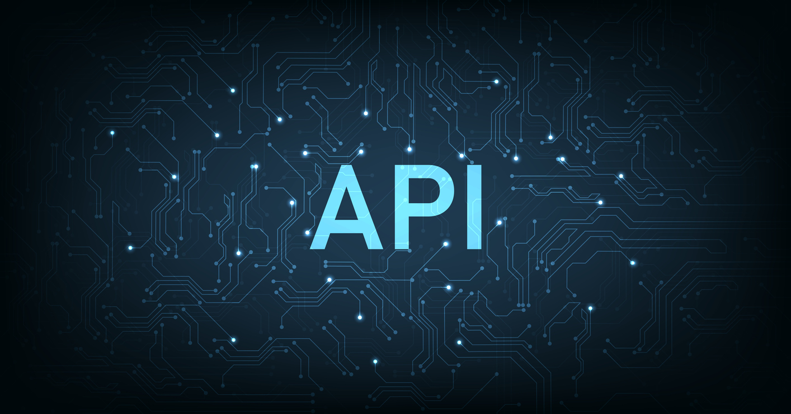

# API

Welkom bij de ReadMe van mijn API

 


# 🤔 Mijn idee

Ik wil een film quiz maken met gebruik van een API. De API die ik ga gebruiken is van MovieDB. Ook is er in mijn project een web API te vinden. Hiervoor heb ik 'BatteryManager' gebruikt. Als templating engine ga ik gebruik maken van EJS. 

## ❔ Wat ga ik allemaal verwerken?

- Zoek pagina
- Quiz maken
- GSAP animaties / Scroll animaties

<!-- # 📖 Hoe moet je mijn applicatie gebruiken?

Ik heb de applicatie gemaakt voor mobiel formaat dus als je naar een ejs pagina gaat moet je f12 gebruiken om deze goed in beeld te krijgen. Of je moet de pagina inspecteren (voor laptop/pc gebruikers). -->

# Mijn proces

## Week 1

Ik ben de eerste week bezig geweest met een API kiezen en fetchen. Ik heb gekozen voor de MovieDB API. Ik heb op Github de repository van school gecloned en een eigen versie ervan gemaakt. Deze heb ik ingericht naar mijn eigen wensen en deze is hieronder te vinden. 

Ik ben deze week ook begonnen met het schetsen van mij ideeën. Deze heb ik aan het einde van de week besproken met mij docent en deze waren goedgekeurd.


### :construction: Mappenstructuur
```
|--- .git
|--- node_modules
|--- public
    |--- images
    |--- fonts
    |--- scripts
        |--- highscore.js
        |--- main.js
        |--- menu.js
        |--- quiz.js
    |--- stylesheets
        |--- main.css
        |--- galley.css
        |--- menu.css
|--- views
    |--- components
        |--- api.ejs
        |--- topmovies.ejs
       
    |--- pages
        |--- highscore.ejs
        |--- index.ejs
        |--- movies.ejs
        |--- quiz.ejs
        |--- search.ejs
    |--- partials      
        |--- footer.ejs
        |--- head.ejs
        |--- nav.ejs
.DS_Store
.editorconfig
.env
.ejlintrc.json
.gitignore
LICENCE
package-lock.json
package.json
README.md
server.js

```

## Week 2
### Zoek functie
Ik heb een pagina gemaakt waar een API in gefetched wordt waar alle films van MovieDB instaan. 

### Quiz werkend en highscore pagina
Ik heb een quiz gemaakt waar de gebruiker zijn/haar naam moet invullen. Vervolgens worden vijf willekeurige films ingeladen van de 'top ranked movies' van MovieDB. Deze worden willekeurig gegenereerd. De score wordt getoond en vervolgens wordt deze opgeslagen in de localhost.

## Week 3

### Home pagina met een Web Api
Op mijn homepagina heb ik een web API geïmplementeerd die reageert op het aansluiten van de oplader in een laptop. Wanneer de oplader wordt aangesloten, wordt er automatisch andere content geladen. Dit zorgt voor een interactieve en dynamische gebruikerservaring.

## API

Ik ben als grote/fetch API de <a href="https://developer.themoviedb.org/reference/intro/getting-started" >MovieDB API</a> gebruikt

Als web api heb ik <a href="https://www.w3.org/TR/battery-status/#examples">'Battery Charger API'</a> gebruikt.


## ⚙️ Gebouwd met behulp van:
- node.js
- git
- ejs
- express
- dotenv
- node-fetch

***

# 💁‍♂️ Installeren
Voordat je mijn project gaat clonen moet je een aantal programma’s eerst installeren.

### NODE.js
**Installeer NodeJs**

Typ `node install` in de terminal

Of gebruikt `node --version` om te checken of je node al hebt geinstalleerd op je computer

### GIT
**Installeer GIT**
Typ `git install` in je terminal

Of gebruik `git --version` om te checken of je GIT al hebt geinstalleerd op je computer

***

# 💻 Mijn applicatie gebruiken

**Clone mijn repositorie**

`git clone https://github.com/Bart-Spons/API-2324/`

**Installeer NPM**

`npm install`

**Start Node.js**

`npm start`

***


# ©️ License
[MIT](https://github.com/Bart-Spons/API/blob/main/LICENSE)


